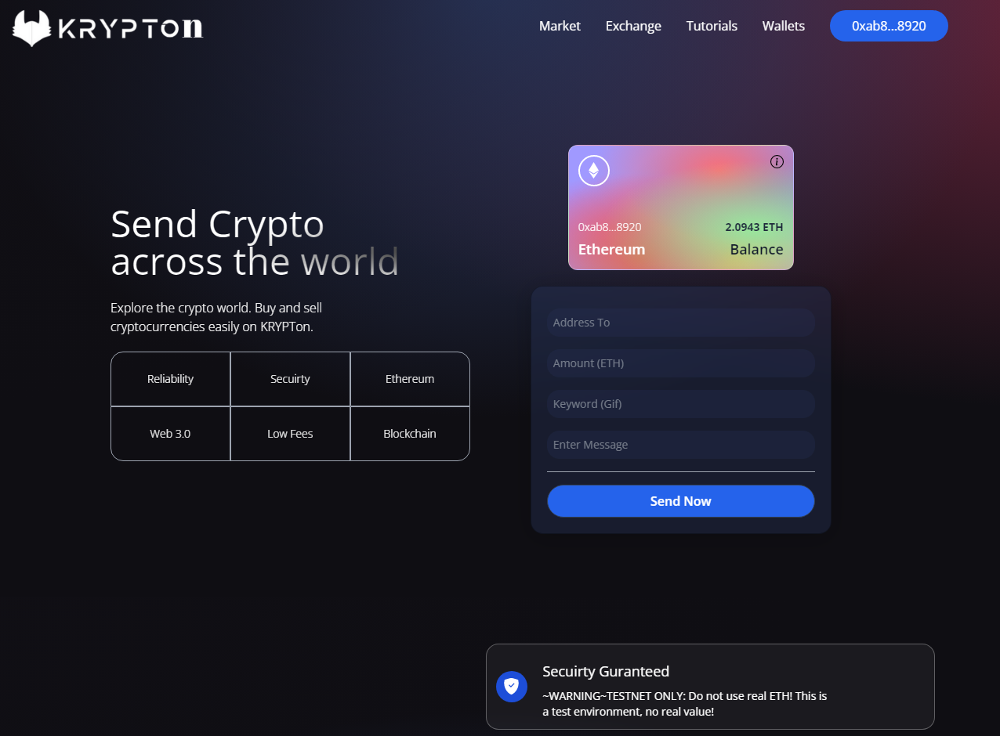

# KRYPTon - DeFi Blockchain Decentralized App.

## About
KRYPTon is a responsive React and Solidity based dApp for sending Ethereum on the Goerli and Sepolia testnets. Developed with the help of JavaScript Mastery, KRYPTon is an open-source project showcasing development skills and experience.

## Features

- Latest Transactions: KRYPTon shows the latest transactions made on the KRYPTon with a GIF and Message that user added with transaction for a sweat memory of that transaction.

- Web3 Based Decentralized DeFi: KRYPTon is a decentralized finance application built using web3 technology.

- Responsive Design: KRYPTon is fully responsive to all devices, making it easy to make transactions on the go.

- User-Friendly Interface: KRYPTon has an intuitive design and a user-friendly interface, making it easy to use for everyone.

## Getting Started

To get started with KRYPTon, simply clone this repository and follow the instructions in the README.md file located in each folder:

- [smart_contract/README.md](./smart_contract/README.md): Instructions for deploying the smart contract.

- [client/README.md](./client/README.md): Instructions for running the client application and interacting with the smart contract.

## Contact

If you have any questions or feedback about KRYPTon, please feel free to reach out to us at https://talhasaddique.netlify.app

## Retrieve your audience

Thank you for considering KRYPTon for your testnet transactions. If you would like to learn more about me, please visit my portfolio site at https://talhasaddique.netlify.app
